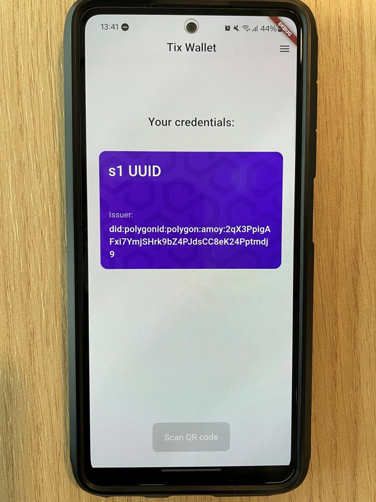

# Secutix Engagement App



## General information

Flutter mobile app containing the PolygonID framework for credential holding. This app serves as the non-branded engagement App of Secutix, holding the TAP credential.

## Setup

The flutter app works with the polygon ID flutter SDK. This dependencies as well as all the others are contained in the pubspec.yaml file.

In order to build the app, and install it on Android (only):

```
flutter pub get

flutter build apk

flutter install
```

Make sure flutter SDK is installed on your computer before continuing. Note that the sdk is constrained with the versions:

```
  sdk: ">=3.0.0 <4.0.0"
```

The app has not been built nor tested on IOS, and many plugins are potentially incompatible.

## Cache clearing and circuits

In order to generate Polygon ID proofs (zero-knowledge), heavy mathematical circuits have to be downloaded. They are automatically downloaded at the clean start of the app, either after installing it or after clearing the cache data. Note that the circuits can go up to 1GB of storage.

## Updates

The current state of the app only support basic tap issuance and holding. The NFL-branded TAP supports KYC additionally, thus the workflow in this app is limited.

